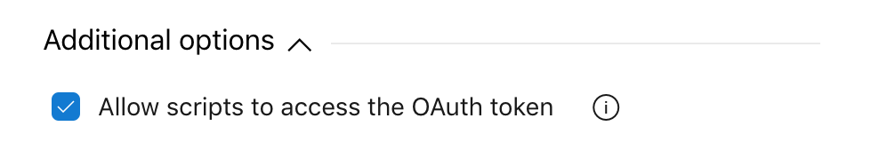
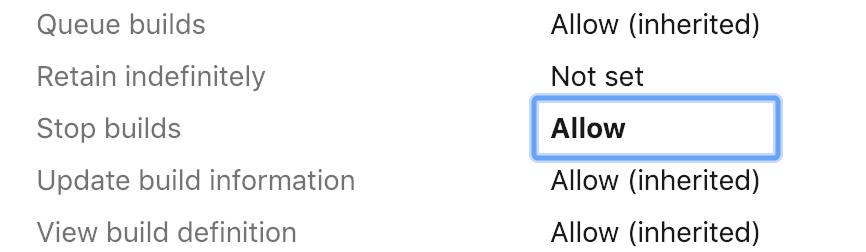

# Cancel Build for CI Trigger

This build task augments the continuous integration (CI) trigger path filters feature.

This task prevents a build when a branch is pushed but contains no changes in path.

The task compares the files in the triggering commit, with the CI path filters. If the CI path filters do not include (or exclude) the files in the triggering commit, the build is cancelled.

## Requirements

This task requires access to the OAuth token and cancel build permissions.

### OAuth

The task requires access to the OAuth token in order to fetch the build's path filters.

Edit the build and select the 'Agent job'. Under 'Additional Options' select 'Allow scripts to access the OAuth token'.

### Cancel Build Permissions

The task requires cancel build permissions in order to stop tasks which do not include (or exclude) files in the triggering commit.

Edit the build and select 'Security' from the top menu and select the 'Project Collection Build Service'. From the 'Access Control Summary' panel on the right change the 'Stop Builds' permission to 'Allow'.

## License

MIT

## Acknowledgments

* Icon by Smashicons licensed under CC 3.0 BY
* Daniel Midler for the idea!